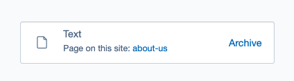
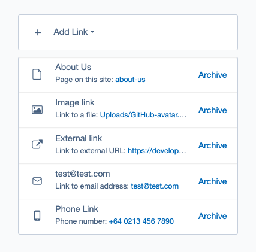
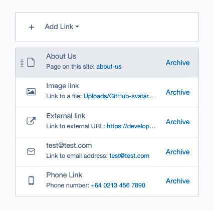
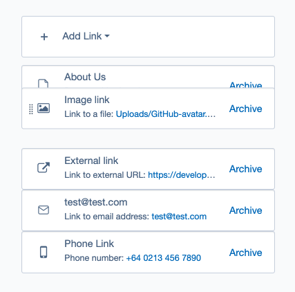
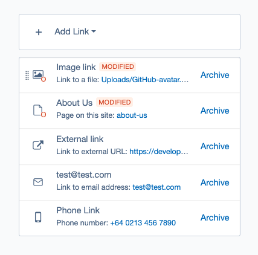
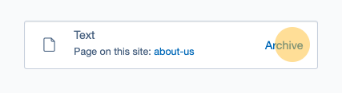
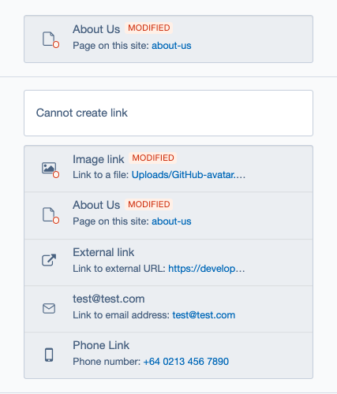
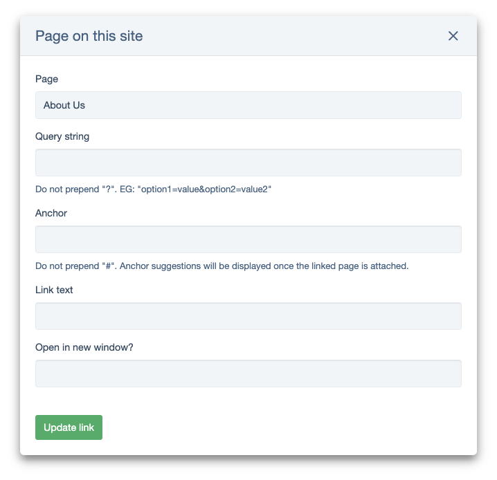
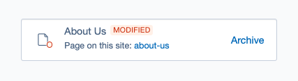

# Essential functionalities associated with the Link field

Previous sections provided fundamental knowledge for creating links. In contrast, this section will delve into the specifics of Likfeld, offering insights into its functionalities like sorting and deletion, essential for effective link management.

The LinkField module offers two primary types of fields: one for creating a single link and the other for generating multiple links. While there are some differences in how these fields operate, let's first outline the key aspects that are common to both types of fields.

> [!NOTE]
> Any information entered is automatically saved upon the creation of a new link or when updates are made to the link data by the user.

> [!NOTE]
> Once created, the user is unable to modify the link type. To establish a different type of link, the user must initiate a new creation process from the beginning.

## Single Link field

The Single LinkField module is designed for managing individual links. To create a new link, users can click on the "Add link" button and select the desired link type from the dropdown menu. This action opens a modal window where users can input the necessary information for creating the link. For detailed information about the default link types, please refer to the ["Link Types"](./01_links_types.md) section.

Once a new link is created, basic information about it will be displayed in the Link field.

To view more detailed information or make changes to an existing link, users need to click the Link field button again. This action opens the modal window where adjustments can be made. If no changes are required, users can simply close the modal window.

## Multi Link field

The MultiLink Field functions similarly to the Single Link Field but offers notable advantages. Users can create various links and easily manage them within a single field. Additionally, they can conveniently sort the links as needed, enhancing usability.

### Sorting multi link field

Let's explore an example demonstrating how users can arrange created links using the Drag & Drop feature.
When hovering the mouse cursor over a link to be moved, it will visually highlight.

By clicking and holding the left mouse button while over the link, one can drag it to the desired position. After releasing the mouse button, all existing links will adjust accordingly.

New changes will be automatically saved, and modified links will be identified.

## Delete Link

The user has the ability to remove an existing link by clicking on the "Archive" button. Upon doing so, the link will be deleted, and the change will be automatically saved.

## Disabled or Read only links

At times, it's necessary to limit certain users' access to creating, editing or removing links. Consequently, editing capabilities for these links will be disabled, rendering them available to users solely in read-only mode. Additionally, users won't be able to reorder  these links if they were created using Multi Link field.

The following examples below illustrate what to expect for the user if editing link capabilities are not available.

## Version history

Link Field includes versioning support, meaning any changes made are recorded in the change history. Additionally, a badge will appear to indicate interference whenever modifications are made.

