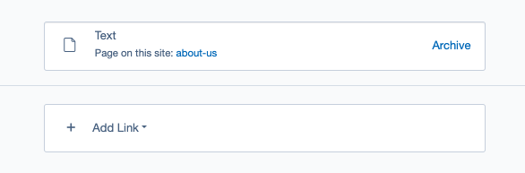

# Creating links in the CMS with LinkField module

## Before we begin
> [!IMPORTANT]
> Make sure that your SilverStripe CMS installation has the [LinkField](https://addons.silverstripe.org/add-ons/silverstripe/linkfield/) module installed.

## Introduction

In this section, we will delve into the process of creating links using the versatile LinkField module. This module offers the flexibility to generate links of diverse types, such as "Page on this site" link or "Link to a file". For further insights, refer to the ["Basic types of links"](01_User_manual/01_links_types.md) section.

There are two primary types of Link field functionalities: one for crafting a single link and another for managing multiple links of similar or varying types. Each type of Link field will be comprehensively discussed in the subsequent section ["Essential functionalities associated with the Link field"](01_User_manual/02_work_with_link_field.md).

The module streamlines the link creation process by providing a user-friendly form that includes all essential fields necessary for link generation. Additionally, it enables sorting capabilities and performs field validation based on the link type during saving.

An important aspect to highlight is that newly generated links are automatically stored, eliminating the need for the user to save the entire page. Moreover, the link types inherently support versioning, ensuring that any modifications made within Link field are traceable in the change history.

## User manual

[CHILDREN includeFolders]
